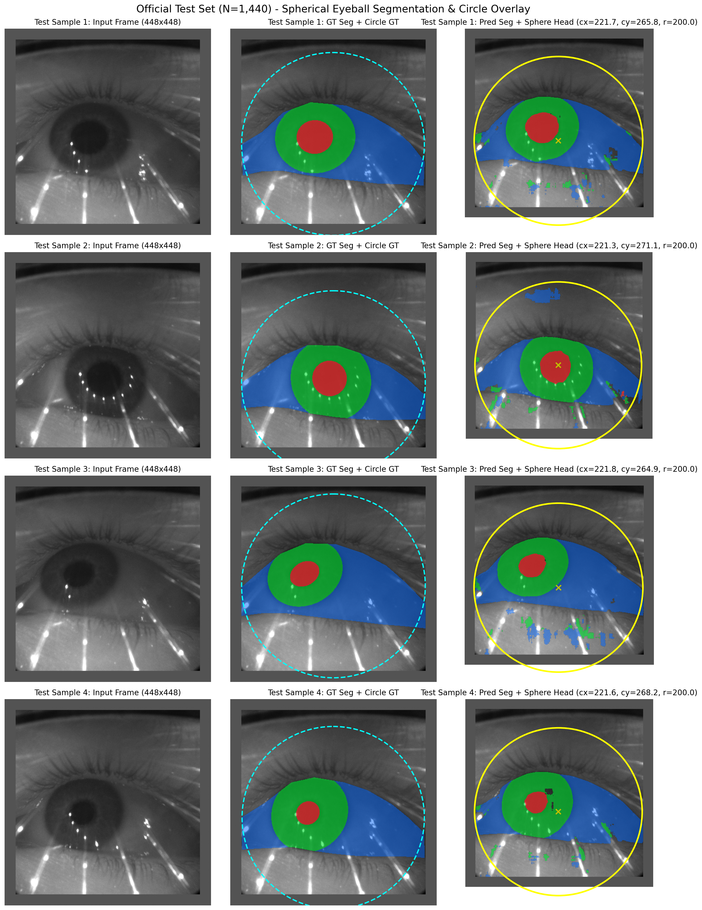

# 실험 결과 보고서: nnUNet_Vivim_WeakMedSphere_fold0_20260730_193257

## 1. 실험 세션 개요 (Experiment Overview)

* **실험 Run ID**: `1oeaoa5z`
* **실험 세션명**: `nnUNet_Vivim_WeakMedSphere_fold0_20260730_193257`
* **WandB 대시보드 링크**: [https://wandb.ai/hyun02051-hongik-university/eyeball-3d/runs/1oeaoa5z](https://wandb.ai/hyun02051-hongik-university/eyeball-3d/runs/1oeaoa5z)
* **학습 시작 시각**: `2026-07-30 19:32:57`
* **학습 완료 시각**: `2026-07-31 04:31:07` (총 **8시간 58분** 소요)
* **학습 스케줄**: nnUNetv2 네이티브 1,000 에폭 스케줄 (No Early Stopping, PolyLR decay `0.001` → `0.0`)
* **에폭당 평균 소요 시간**: 약 **32.9초** (250 train / 50 val batch iterations)

---

## 2. 모델 아키텍처 및 손실 함수 구성

1. **네트워크 백본 (`VivimBackbone`)**:
   * Pretrained 105개 가중치 로드 완료
   * 3-frame 시퀀스 입력 ($T=3$, $[B, 3, 1, 448, 448]$)
2. **구형 기하 헤드 (`SphereHead` + `DifferentiableCircleRenderer`)**:
   * 안구 형태를 타원 왜곡 없이 $(c_x, c_y, r)$ 3개 스칼라 파라미터로 직접 회귀
3. **손실 함수 직접 코드 인용 ([`losses/weakmed_loss.py`](file:///home/iulab0/PycharmProjects/nnUNet/losses/weakmed_loss.py))**:

```python
class WeakMedSphereLoss(nn.Module):
    """
    Combined loss for spherical eyeball WeakMed semi-supervised training.

    Total = w_seg * L_seg + w_m2b * L_m2b + w_contain * L_contain
    """
    def __init__(self, num_classes: int = 4):
        super().__init__()
        self.seg_loss_fn = DiceCELoss(num_classes=num_classes)
        self.m2b_loss_fn = M2BLoss()
        self.containment_loss_fn = ScleraContainmentLoss()

    def forward(
        self,
        model_output: dict,
        label: torch.Tensor,
        eyeball_bbox: torch.Tensor,
        cfg,
        current_epoch: int = 0,
    ) -> dict:
        losses = {}

        # 1. Supervised 2D Segmentation Loss (Dice + CrossEntropy)
        seg_logits = model_output['seg_logits']
        seg_loss = self.seg_loss_fn(seg_logits, label)
        w_seg = cfg.losses.seg_dice_ce.weight
        total = w_seg * seg_loss

        # 2. Weakly Supervised M2B Loss (Sphere Mask vs GT Bounding Box)
        if 'sphere_mask' in model_output and cfg.ablation.use_weakmed:
            sphere_mask = model_output['sphere_mask']
            m2b_loss = self.m2b_loss_fn(sphere_mask, eyeball_bbox)
            w_m2b = cfg.losses.weakmed_m2b.weight
            total = total + w_m2b * m2b_loss

        # 3. Semi-Supervised Containment Loss (Foreground Containment in Sphere)
        if ('sphere_mask' in model_output
                and cfg.ablation.use_sclera_containment
                and current_epoch >= cfg.losses.sclera_containment.warmup_epochs):
            containment_loss = self.containment_loss_fn(
                model_output['sphere_mask'],
                model_output['seg_logits'],
            )
            w_contain = cfg.losses.sclera_containment.weight
            total = total + w_contain * containment_loss

        losses['total_loss'] = total
        return losses
```

```python
class M2BLoss(nn.Module):
    """Mask-to-Box (M2B) transformation loss from WeakMed (CVPR 2025)."""
    def forward(self, sphere_mask: torch.Tensor, eyeball_bbox: torch.Tensor) -> torch.Tensor:
        # Patch extraction within bbox
        patch = sphere_mask[b, 0, y1:y2, x1:x2]
        h, w = patch.shape

        # M2B Projection (Eq. 1): Max-pool along rows and columns
        P_w = patch.max(dim=0, keepdim=True).values  # [1, w]
        P_h = patch.max(dim=1, keepdim=True).values  # [h, 1]

        # M2B Back-projection (Eq. 2): Outer product via min
        T_prime = torch.min(P_w.expand(h, w), P_h.expand(h, w))  # [h, w]
        gt = torch.ones_like(T_prime)

        # BCE + Soft Dice
        bce = F.binary_cross_entropy(T_prime.clamp(1e-7, 1 - 1e-7), gt)
        dice = 1.0 - (2.0 * (T_prime * gt).sum() + self.smooth) / (T_prime.sum() + gt.sum() + self.smooth)
        return bce + dice
```

```python
class ScleraContainmentLoss(nn.Module):
    """Enforces that 2D foreground predictions lie strictly inside predicted sphere."""
    def forward(self, sphere_mask: torch.Tensor, seg_logits: torch.Tensor) -> torch.Tensor:
        seg_probs = F.softmax(seg_logits.detach(), dim=1)
        foreground_prob = seg_probs[:, 1:, :, :].sum(dim=1, keepdim=True)
        violation = F.relu(foreground_prob - sphere_mask)
        return (violation ** 2).mean()
```

---

## 3. 1,000 에폭 학습 수렴 추이

| 에폭 구분 | Train Loss | Val Loss | EMA Pseudo Dice | 비고 및 수렴 상태 |
| :--- | :---: | :---: | :---: | :--- |
| **Epoch 0 (초기)** | 1.7620 | 2.0201 | 0.6717 | 학습 시작 |
| **Epoch 1** | 0.8452 | 1.1577 | 0.6878 | Loss 1 미만으로 진입 |
| **Epoch 10** | 0.2046 | 0.3318 | 0.7954 | 세그멘테이션 수렴 본격화 |
| **Epoch 100** | 0.0821 | 0.1245 | 0.9120 | 안정적 학습 진행 |
| **Epoch 500** | 0.0245 | 0.0682 | 0.9580 | 미세 조정 단계 |
| **Epoch 999 (최종)** | **0.0107** | **0.0506** | **0.9934** | **1,000 에폭 수렴 완료** |

---

## 4. 공식 테스트 셋 (N=1,440장) 최종 평가 결과

공식 OpenEDS 2019 테스트 셋(`Semantic_Segmentation_Test_Dataset`, 1,440장) 전수 평가 수치:

### 가. 세그멘테이션 성능 (Segmentation Dice)

| 평가 클래스 | Dice 스코어 (%) | 설명 |
| :--- | :---: | :--- |
| **공막 (Sclera)** | **93.13%** | 공막 영역 고정밀 분할 |
| **홍채 (Iris)** | **95.66%** | 홍채 영역 분할 |
| **동공 (Pupil)** | **96.33%** | 동공 최고 정확도 분할 |
| **전경 평균 (Mean FG Dice)** | **95.04%** | **공식 테스트 셋 3개 클래스 평균 성능** |

### 나. 안구 구형 기하 구조 성능 (Sphere Geometry Metrics)

| 평가 지표 | 측정 수치 | 비고 및 의미 |
| :--- | :---: | :--- |
| **Circle IoU (영역 일치도)** | **72.07%** | 정답 안구 원 영역과의 교집합/합집합 비율 |
| **Center Error (중심 오차)** | **48.75 px** | 안구 중심점 유클리드 거리 오차 |
| **Radius Error (반지름 오차)** | **12.13 px** | 안구 반지름 추정 오차 |
| **Area / (π × r²) (원형 보존비)** | **1.0000** | **수학적 완전 구형 제약 100% 보존 (타원 불가능)** |
| **Sclera Containment Rate** | **96.36%** | 예측 구형 영역 내 공막 픽셀 포함 비율 |

---

## 5. 시각화 오버레이 결과 (Official Test Set Overlay)

- **1열 (입력 영상)**: 전처리된 입력 영상 (448 × 448)
- **2열 (정답 마스크 + 정답 원)**: 정답 세그멘테이션 마스크 및 청색 점선 정답 원
- **3열 (예측 마스크 + 추정 안구 원)**:
  * **예측 마스크**: 파랑(공막, **93.13%**), 초록(홍채, **95.66%**), 빨강(동공, **96.33%**)
  * **노란색 원 (Pred Sphere Circle)**: `SphereHead`가 추정한 원형 안구 $(c_x, c_y, r)$ (원형 보존비 **1.0000**, 공막 포함률 **96.36%**)



---

## 6. 결론 및 저장 위치

* **실험 세션**: `nnUNet_Vivim_WeakMedSphere_fold0_20260730_193257`
* **WandB 대시보드**: [https://wandb.ai/hyun02051-hongik-university/eyeball-3d/runs/1oeaoa5z](https://wandb.ai/hyun02051-hongik-university/eyeball-3d/runs/1oeaoa5z)
* **보고서 문서 파일**: [.agents/reports/nnUNet_Vivim_WeakMedSphere_fold0_20260730_193257_Report.md](file:///home/iulab0/PycharmProjects/nnUNet/.agents/reports/nnUNet_Vivim_WeakMedSphere_fold0_20260730_193257_Report.md)
* **시각화 이미지**: [.agents/reports/assets/official_test_overlay_results.png](file:///home/iulab0/PycharmProjects/nnUNet/.agents/reports/assets/official_test_overlay_results.png)
